# CAYP Architecture & Diagrams

This document provides visual representations of the CAYP specification repository structure, validation workflows, and integration patterns.

---

## Repository Structure

```mermaid
graph TB
    subgraph "cayp-spec Repository"
        Root["/"]

        Root --> Spec["📄 specification/"]
        Root --> Schema["📄 schemas/"]
        Root --> Examples["📁 examples/"]
        Root --> Docs["📁 docs/"]
        Root --> Tools["📁 tools/"]
        Root --> VSCode["📁 .vscode/"]
        Root --> README["📄 README.md"]
        Root --> Workspace["📄 cayp-spec.code-workspace"]

        Spec --> SpecFile["CAYP-SPEC-v1.0.md<br/>(Core technical spec)"]

        Schema --> SchemaFile["cayp-schema-v1.0.json<br/>(JSON Schema)"]

        Examples --> Valid["📁 valid/"]
        Examples --> Invalid["📁 invalid/"]
        Examples --> Migration["📁 migration/"]

        Valid --> ValidEx["comprehensive-agent.cayp"]

        Invalid --> TypeErr["type-coercion-errors.cayp"]
        Invalid --> SecErr["security-violations.cayp"]
        Invalid --> StrErr["structural-errors.cayp"]

        Migration --> Before["before-yaml.yaml"]
        Migration --> After["after-cayp.cayp"]

        Docs --> Merge["MERGE_SUMMARY.md"]
        Docs --> Phase["PHASE_1_REVIEW.md"]
        Docs --> Session["SESSION_SUMMARY.md"]
        Docs --> Work["WORK_SUMMARY_2025-11-08.md"]
        Docs --> Arch["ARCHITECTURE.md"]

        Tools --> Future["(Future validators & tools)"]

        VSCode --> Config["VS Code config files"]
    end

    style Spec fill:#e1f5ff
    style Schema fill:#fff3e0
    style Examples fill:#f3e5f5
    style Docs fill:#e8f5e9
    style Tools fill:#fff9c4
```



---

## CAYP Validation Workflow

```mermaid
flowchart TD
    Start([Input: CAYP File]) --> Parse[Parse YAML]

    Parse -->|Success| Syntax{Syntax Validation}
    Parse -->|Fail| SyntaxErr[❌ Syntax Error]

    Syntax -->|Pass| Version{Check cayp_version}
    Syntax -->|Fail| SyntaxErr

    Version -->|Valid| Forbidden{Check Forbidden<br/>Features}
    Version -->|Invalid| VersionErr[❌ Version Error]

    Forbidden -->|None Found| Size{Size Limits}
    Forbidden -->|Found| ForbiddenErr[❌ Security Error:<br/>Anchors/Aliases/Tags]

    Size -->|Within Limits| Types{Type Validation}
    Size -->|Exceeded| SizeErr[❌ Size Limit Error]

    Types -->|Valid| SchemaVal{Schema Validation}
    Types -->|Invalid| TypeErr[❌ Type Error:<br/>Ambiguous values]

    SchemaVal -->|Pass| Required{Required Fields}
    SchemaVal -->|Fail| SchemaErr[❌ Schema Error]

    Required -->|Present| Semantic{Semantic Validation}
    Required -->|Missing| ReqErr[❌ Missing Required<br/>Fields]

    Semantic -->|Pass| Security{Security Validation}
    Semantic -->|Fail| SemErr[❌ Semantic Error:<br/>Invalid references]

    Security -->|Pass| Success[✅ Valid CAYP]
    Security -->|Fail| SecErr2[❌ Security Error:<br/>Hardcoded secrets]

    SyntaxErr --> Report[Generate Error Report]
    VersionErr --> Report
    ForbiddenErr --> Report
    SizeErr --> Report
    TypeErr --> Report
    SchemaErr --> Report
    ReqErr --> Report
    SemErr --> Report
    SecErr2 --> Report

    Success --> Execute[Ready for Execution]
    Report --> Fix[Developer Fixes]
    Fix --> Start

    style Success fill:#4caf50,color:#fff
    style Execute fill:#8bc34a,color:#fff
    style SyntaxErr fill:#f44336,color:#fff
    style VersionErr fill:#f44336,color:#fff
    style ForbiddenErr fill:#f44336,color:#fff
    style SizeErr fill:#f44336,color:#fff
    style TypeErr fill:#f44336,color:#fff
    style SchemaErr fill:#f44336,color:#fff
    style ReqErr fill:#f44336,color:#fff
    style SemErr fill:#f44336,color:#fff
    style SecErr2 fill:#f44336,color:#fff
```



---

## CAYP in Agentic Systems


---

## YAML to CAYP Migration Process

```mermaid
flowchart LR
    subgraph "Input"
        YAML[Legacy YAML File]
    end

    subgraph "Analysis Phase"
        YAML --> Analyze[Analyze Issues]

        Analyze --> Issue1[Type Coercion<br/>no → false]
        Analyze --> Issue2[Sexagesimal<br/>1.20 → 80]
        Analyze --> Issue3[Security<br/>Anchors/Aliases]
        Analyze --> Issue4[Hardcoded<br/>Secrets]
    end

    subgraph "Migration Phase"
        Issue1 --> Fix1[Quote strings:<br/>country: 'no']
        Issue2 --> Fix2[Quote versions:<br/>version: '1.20']
        Issue3 --> Fix3[Remove anchors,<br/>expand content]
        Issue4 --> Fix4[Extract to env vars]

        Fix1 --> Migrate[Automated Migration]
        Fix2 --> Migrate
        Fix3 --> Migrate
        Fix4 --> Migrate

        Migrate --> AddMeta[Add Required Fields]
        AddMeta --> AddSafety[Add Safety Config]
    end

    subgraph "Validation Phase"
        AddSafety --> Validate[CAYP Validator]
        Validate -->|Pass| Success[✅ Valid CAYP]
        Validate -->|Fail| Manual[Manual Fixes Needed]
        Manual --> Validate
    end

    subgraph "Output"
        Success --> CAYP2[CAYP Config File]
        Success --> Report[Migration Report]
    end

    style YAML fill:#ffebee
    style CAYP2 fill:#e8f5e9
    style Success fill:#4caf50,color:#fff
    style Validate fill:#2196f3,color:#fff
```



---

## CAYP Type System

```mermaid
graph TB
    subgraph "CAYP Type System"
        Root[Scalar Types]

        Root --> String[String]
        Root --> Number[Number]
        Root --> Boolean[Boolean]
        Root --> Null[Null]

        String --> SafeStr["✅ 'hello'<br/>✅ 'no'<br/>✅ '1.20'"]
        String --> UnsafeStr["❌ no<br/>❌ yes<br/>❌ 1.20"]

        Number --> Int["Integer<br/>✅ 42<br/>✅ -10"]
        Number --> Float["Float<br/>✅ 3.14<br/>✅ 1.5e10"]
        Number --> NoHex["❌ 0xFF<br/>❌ 0o755<br/>❌ 1:20"]

        Boolean --> TrueFalse["✅ true<br/>✅ false"]
        Boolean --> Legacy["❌ yes<br/>❌ on<br/>❌ 1"]

        Null --> Explicit["✅ null<br/>✅ ~"]
        Null --> Implicit["❌ empty value"]
    end

    subgraph "Complex Types"
        Complex[Collections]

        Complex --> Map[Mapping]
        Complex --> Seq[Sequence]

        Map --> MapEx["key: value<br/>nested:<br/>  child: value"]
        Seq --> SeqEx["- item1<br/>- item2<br/>- item3"]
    end

    subgraph "Forbidden Features"
        Forbidden[🚫 Forbidden]

        Forbidden --> Anchor["Anchors: &anchor"]
        Forbidden --> Alias["Aliases: *alias"]
        Forbidden --> Merge["Merge: &lt;&lt;"]
        Forbidden --> Custom["Custom Tags: !!python"]
        Forbidden --> Binary["Binary: !!binary"]
    end

    style SafeStr fill:#4caf50,color:#fff
    style UnsafeStr fill:#f44336,color:#fff
    style Int fill:#4caf50,color:#fff
    style Float fill:#4caf50,color:#fff
    style NoHex fill:#f44336,color:#fff
    style TrueFalse fill:#4caf50,color:#fff
    style Legacy fill:#f44336,color:#fff
    style Explicit fill:#4caf50,color:#fff
    style Implicit fill:#f44336,color:#fff
    style Forbidden fill:#f44336,color:#fff
```



---

## Development Workflow


---

## CAYP Safety Architecture

```mermaid
graph TB
    subgraph "Input Layer"
        Input[User Input]
    end

    subgraph "Safety Controls"
        Input --> Content[Content Filter]

        Content -->|Safe| Rate[Rate Limiter]
        Content -->|Unsafe| Block1[❌ Block Request]

        Rate -->|Within Limit| Auth[Authentication]
        Rate -->|Exceeded| Block2[❌ Throttle]

        Auth -->|Valid| Validate[Input Validation]
        Auth -->|Invalid| Block3[❌ Reject]
    end

    subgraph "Processing Layer"
        Validate --> Process[Agent Processing]

        Process --> Model[Model Inference]
        Process --> Tool[Tool Execution]

        Model --> Output1[Model Output]
        Tool --> Output2[Tool Results]
    end

    subgraph "Output Controls"
        Output1 --> OutFilter[Output Validation]
        Output2 --> OutFilter

        OutFilter -->|Safe| Audit[Audit Logger]
        OutFilter -->|Unsafe| Block4[❌ Filter Output]

        Audit --> Log[(Logs)]
        Audit --> Metrics[(Metrics)]
    end

    subgraph "Response"
        Audit --> Response[User Response]
    end

    style Block1 fill:#f44336,color:#fff
    style Block2 fill:#f44336,color:#fff
    style Block3 fill:#f44336,color:#fff
    style Block4 fill:#f44336,color:#fff
    style Content fill:#ff9800,color:#fff
    style OutFilter fill:#ff9800,color:#fff
    style Audit fill:#4caf50,color:#fff
```

---

## Use Case: Multi-Step Agent Workflow


---

## File Format Comparison

```mermaid
graph LR
    subgraph "Legacy YAML"
        Y1["❌ Type coercion<br/>no → false"]
        Y2["❌ Sexagesimal<br/>1.20 → 80"]
        Y3["❌ Security risks<br/>Anchors/aliases"]
        Y4["❌ Version chaos<br/>1.1 vs 1.2"]
    end

    subgraph "JSON"
        J1["✅ Deterministic"]
        J2["✅ Secure"]
        J3["❌ No comments"]
        J4["❌ Verbose"]
        J5["❌ No multi-line"]
    end

    subgraph "CAYP"
        C1["✅ Deterministic"]
        C2["✅ Secure"]
        C3["✅ Comments"]
        C4["✅ Readable"]
        C5["✅ Multi-line"]
        C6["✅ Agentic types"]
        C7["✅ Validation"]
    end

    Y1 -.->|Avoid| C1
    Y2 -.->|Fix| C1
    Y3 -.->|Secure| C2
    Y4 -.->|Standardize| C1

    J1 -.->|Keep| C1
    J2 -.->|Keep| C2
    J3 -.->|Add| C3
    J4 -.->|Improve| C4
    J5 -.->|Add| C5

    style Y1 fill:#ffebee
    style Y2 fill:#ffebee
    style Y3 fill:#ffebee
    style Y4 fill:#ffebee
    style C1 fill:#e8f5e9
    style C2 fill:#e8f5e9
    style C3 fill:#e8f5e9
    style C4 fill:#e8f5e9
    style C5 fill:#e8f5e9
    style C6 fill:#e8f5e9
    style C7 fill:#e8f5e9
```



---

## Legend

- 🔵 Blue: Process/Validation
- 🟢 Green: Success/Safe/Valid
- 🔴 Red: Error/Blocked/Invalid
- 🟠 Orange: Warning/Security Check
- 📁 Folder
- 📄 Document/File

---

**Last Updated:** 2025-11-16
**Version:** 1.0
